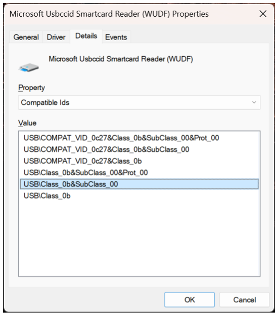

---
# required metadata
title: USB NFC smart card reader support for Windows 365 Link
titleSuffix:
description: Learn about USB NFC smart card reader support for Windows 365 Link.
keywords:
author: ErikjeMS  
ms.author: erikje
manager: dougeby
ms.date: 04/02/2025
ms.topic: overview
ms.service: windows-365-link
ms.localizationpriority: high
ms.assetid: 

# optional metadata

#ROBOTS:
#audience:

ms.reviewer: ketrem
ms.suite: ems
search.appverid: MET150
#ms.tgt_pltfrm:
ms.custom: intune-azure; get-started; intro-hub-or-landing
ms.collection:
- M365-identity-device-management
- tier2
- essentials-overview
---

# USB NFC smart card reader support

Windows 365 Link supports USB-CCID (Chip Card Interface Device) compatible near-field communication (NFC) FIDO2 smart card readers that:

- Are compatible with the chip card interface device (CCID)  USB protocol.
- Have USB base class **0b** and subclass **00**.
- Use NFC Client to Authenticator Protocal (CTAP) for FIDO2 sign in.
- Don’t require a third-party driver (either from Windows Update or through manual driver installation)
- Work on a Windows Desktop with the inbox CCID driver.

For more information, see [Microsoft Class Drivers for USB CCID Smart Cards](/previous-versions/windows/hardware/design/dn653571(v=vs.85)).

## Check compatibility

There are two ways to check if your NFC reader is compatible with Windows 365 Link.

- Refer to the documentation provided by the reader's manufacturer.
- Use the Device Manager on your PC:
  1. Plug in the USB NFC reader to a Windows PC (not Windows 365 Link).
  2. In Device Manager, locate the reader device, right-click on it, and select **Properties**.
  3. In the **Details** tab, select **Compatible Ids** properties.
  4. The reader is compatible if **USB\Class_0b&SubClass_00** is in the list.

## Sign in with an NFC Reader

Whether you sign into a device you used before or a new device, follow these steps to sign in with an NFC reader:

1. On the landing page, select the USB icon.
2. After you see the sign in prompt **Tap your security key on the reader or insert it into the USB port**, tap your key on the NFC reader.
3. Type your security key PIN (if required).
4. Type the FIDO PIN and press the enter key.
5. Tap and hold the FIDO token against the reader.
6. You’re signed in.

<!-- ########################## -->
## Next steps

For information about peripheral ports, software, and box contents, see [What's in the box](whats-in-the-box.md).

[First time user setup](setup.md).
